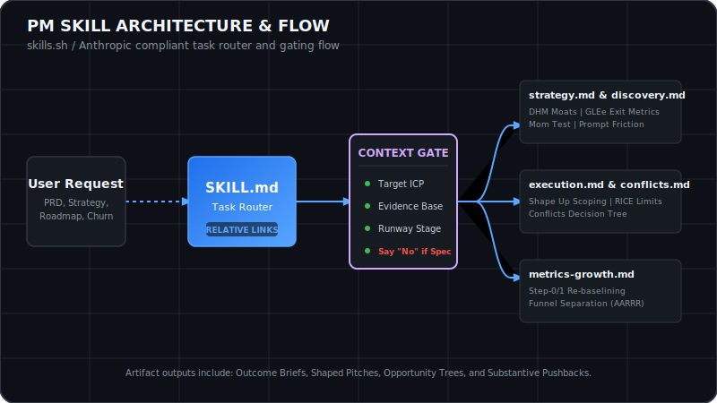

<p align="left">
  
  
  
  
</p>

[](https://skills.sh/rajann44/pm-skills)



This repository contains a world-class, production-quality agent skill in the skills.sh / Anthropic `SKILL.md` format. It equips AI coding assistants (such as Claude Code, Cursor, and other compatible systems) with expert-level product leadership capabilities to write outcome-oriented PRDs, build strategic roadmaps, prioritize backlogs objectively, and diagnose complex metrics drops.

---

## 🚀 Installation & Setup

> [!TIP]
> **Quick Start:** Install this skill directly in your active workspace using the skills.sh CLI:
> ```bash
> npx skills add rajann44/pm-skills
> ```
> *Compatible with Claude Code, Cursor, Codex, and other skills.sh-compatible agent environments.*

*   **Registry Page:** [skills.sh/rajann44/pm-skills](https://www.skills.sh/rajann44/pm-skills)
*   **Documentation Page:** [skills.sh/rajann44/pm-skills/product-management](https://www.skills.sh/rajann44/pm-skills/product-management)

---

## 📂 Capability Directory & Reference Files

The entry point of this skill is [SKILL.md](./product-management/SKILL.md), which contains the main agent router and core execution principles. The router directs tasks to these deep-dive reference files using relative repository links:

| Task Category | reference File Path | Description / Key Focus |
| :--- | :--- | :--- |
| **🎨 Strategy & OKRs** | [strategy.md](./product-management/references/strategy.md) | ICP definition, DHM moats, and GEM sequencing |
| **🔍 Customer Discovery** | [discovery.md](./product-management/references/discovery.md) | Continuous Discovery, OSTs, and the Mom Test |
| **🛠️ Execution & Cycles** | [execution.md](./product-management/references/execution.md) | Shape Up cycle scoping, RICE limits, and hill charts |
| **📈 Metrics & Growth** | [metrics-growth.md](./product-management/references/metrics-growth.md) | North Stars, Pirate Metrics (AARRR), and step-0/1 checks |
| **⚖️ Methodological Conflicts** | [conflicts.md](./product-management/references/conflicts.md) | Framework decision trees (e.g. Cagan vs. Shape Up) |
| **📄 Document Templates** | [artifacts-templates.md](./product-management/references/artifacts-templates.md) | PRDs, Opportunity Trees, and Customer Interview guides |
| **📖 Core Glossary** | [glossary.md](./product-management/references/glossary.md) | 22 canonical product management terms defined |
| **🚫 Scope Limitations** | [limitations.md](./product-management/references/limitations.md) | v1 scope exclusions and workarounds |

---

## 🏆 Framework & Source Attribution Matrix

Every framework utilized in this skill is synthesized from canonical public product literature and explicitly credited:

| Core Framework | Author / Primary Source | Source Link |
| :--- | :--- | :--- |
| **Outcome Brief PRDs & OKRs** | Marty Cagan / SVPG | [svpg.com/articles](https://svpg.com/articles/) |
| **DHM, GLEe, GEM Sequencing** | Gibson Biddle / ex-Netflix | [gibsonbiddle.com](https://www.gibsonbiddle.com) |
| **Continuous Discovery & OSTs** | Teresa Torres / Product Talk | [producttalk.org](https://www.producttalk.org) |
| **Shape Up (Appetites, Hill Charts)** | Ryan Singer / Basecamp | [basecamp.com/shapeup](https://basecamp.com/shapeup) |
| **RICE Prioritization Limits** | Lenny Rachitsky / Lenny's Newsletter | [lennysnewsletter.com](https://www.lennysnewsletter.com) |
| **Now/Next/Later Roadmaps** | Janna Bastow / Mind the Product | [mindtheproduct.com](https://www.mindtheproduct.com) |
| **Running Product Reviews** | First Round Review | [firstround.com/review](https://firstround.com/review/) |
| **Network Effects & Moats** | Andrew Chen / Reforge | [andrewchen.com](https://andrewchen.com) |
| **Platform vs. Product Strategy** | Ben Thompson / Stratechery | [stratechery.com](https://stratechery.com) |
| **The Mom Test (Interviews)** | Rob Fitzpatrick | [momtestbook.com](https://www.momtestbook.com) |

---

## 🧠 Core Design Principles

> [!IMPORTANT]
> This skill enforces four strict operational guardrails to prevent common AI product management anti-patterns:
> 
> *   `THE CONTEXT GATE`  
>     Every PRD, roadmap, or prioritization task must first establish the target customer (ICP), evidence base (citing telemetry or qualitative logs), and cycle constraints before proceeding.
> *   `LICENSE TO SAY NO`  
>     Speculative or unbacked feature requests are met with substantive pushback, including specific assumptions, falsifiable kill criteria, a minified concept draft, and a CEO decision framework.
> *   `GEM STRATEGY-PRIORITIZATION ALIGNMENT`  
>     Features are prioritized based on their direct alignment with the active phase of the GEM roadmap (Engagement, Monetization, or Growth); strategic mismatches must be formally justified.
> *   `CONFLICTS, NOT SMOOTHIES`  
>     The skill explicitly prevents blending conflicting methodologies (e.g. Shape Up vs. Cagan PRDs) into a "smoothie"; it forces a clear selection and enforces its rules consistently.

---

## 🛡️ Validation & Evidence Trail

This skill has been hardened through 9 rigorous validation scenarios:
1.  **[Scenario 1: Team Workspaces PRD](./validation/scenario-1.md)** - Applies the Minimum Evidence Weight rule to scale cycle appetites.
2.  **[Scenario 2: 15% Activation Drop](./validation/scenario-2.md)** - Applies Step-0 telemetry error re-baselining and Step-1 shape analysis.
3.  **[Scenario 3: B2B Startup Strategy](./validation/scenario-3.md)** - Defines Fintech ICP compliance stress-tests and GLEe exit criteria.
4.  **[Scenario 4: Churn Interview Guide](./validation/scenario-4.md)** - Drafts Mom-Test interview questions anchored to session telemetry.
5.  **[Scenario 5: Backlog Roadmap Prioritization](./validation/scenario-5.md)** - Prioritizes 8 features using GEM alignment and evidence citations.
6.  **[Scenario 6: Chatbot PRD Pushback](./validation/scenario-6.md)** - Substantively pushes back against unbacked requests with falsifiable kill criteria.
7.  **[Scenario 7: Ambiguous Routing](./validation/scenario-7.md)** - Prompts user with 4 structured diagnostic questions rather than dumping templates.
8.  **[Scenario 8: Conflicting Evidence](./validation/scenario-8.md)** - Resolves buyer vs. user needs for a $400k ARR feature request.
9.  **[Scenario 9: Sunk Cost Evaluation](./validation/scenario-9.md)** - Evaluates a failing beta using Ship/Iterate/Kill options under PMF metrics warnings.

*Logs of development gaps, spot-check reports, and before/after diffs are located in the [validation/](./validation/) directory.*

---

## ⚠️ Known Limitations

> [!WARNING]
> This skill has three deliberate v1 scope limitations. If your task falls into these categories, the router will declare the limits and fallback to general principles:
> 
> 1.  **Go-To-Market (GTM) & Pricing Strategy:** Out of scope for v1 (Future sibling: `pm-gtm-pricing`).
> 2.  **Technical Strategy & Platform Trade-offs:** Out of scope for v1 (Future sibling: `pm-technical-strategy`).
> 3.  **Consumer Growth Loops & Virality:** Out of scope for v1 (Future sibling: `pm-consumer-growth`).
> 
> *For details on scope exclusions and workarounds, refer to [limitations.md](./product-management/references/limitations.md).*
